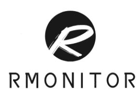
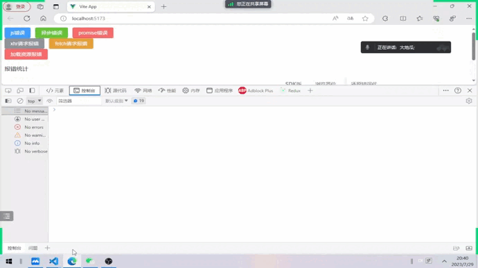
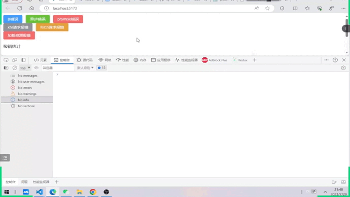
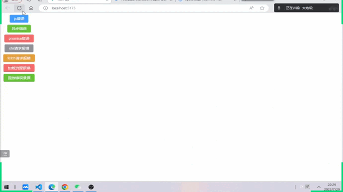

<!--
 * @Descripttion: 
 * @version: 
 * @Author: ZhengXiaoRui
 * @email: zheng20010712@163.com
 * @Date: 2023-07-29 16:09:19
 * @LastEditors: ZhengXiaoRui
 * @LastEditTime: 2023-07-30 18:15:53
-->

# RMonitor

    
    
前端监控SDK

**项目开始时间：2023.06，目前仍在迭代中**

**项目成员：小码大哈、1227010555、chenday7621**

### 这是个什么项目？

前端监控系统，支持React / Vue 项目无痛（目前还是非常痛的）接入，提供基础监控能力，并且支持开发者插入自定义插件

避免线上项目完全***“裸奔”***，帮助开发者时刻紧盯线上项目

### 为什么要做这个项目？

蚂蚁实习期间接触到监控系统，非常感兴趣，于是便想挑战一下自己做一个监控系统项目，主要想提高一下自己的技术水平，并且增加对前端项目监控指标的了解，能在平时开发过程中更加有意识地去注意一些问题，减少代码BUG、线上故障。

### 目前RMonitor提供怎样的能力？

[√] ✈️ **多种错误采集**：代码错误、Promise错误、异步错误、加载资源错误等

[√] ✈️ **白屏检测**：兼容骨架屏、非骨架屏，提供白屏修复机制

[√] ✈️ **性能数据**：FMP、FP、FCP、FSP、TTI、TTFB

[√] ✈️ **多种错误还原方式**：源码定位、播放录屏，用户行为栈

[√] ✈️ **多种上报方式**：默认web beacon，也支持图片打点，http上报

[√] ✈️ **灵活可自定义**：支持hooks注入

### 功能展示

（些许简陋，视频存放在public下）

错误捕获

性能数据

录屏回放

### 后续规划

尽可能无痛接入：回放、服务器存储、后端代码模板、可视化系统等等

尽可能保证数据安全：sourcemap文件存储

尽可能有用：报警功能

### 写一个监控系统的好处

对前端项目可能出现的错误更加敏感，减少编码过程中发生的错误

对项目的监控指标更熟悉，更好地定位已经发生的错误

当然也期待能够真正被大家所使用~

遇到任何问题欢迎随时联系（联系方式在主页）
